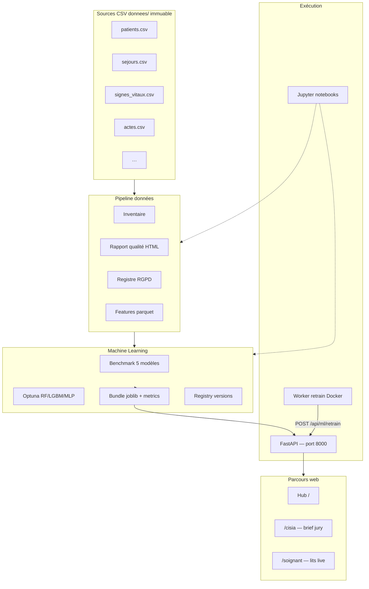

# CISIA Santé — Prédiction du risque de réadmission à 30 jours

Données **synthétiques** uniquement : jamais une décision clinique réelle.

**Python requis : 3.13** (recommandé). Éviter 3.14 — `pyarrow` n’y est pas disponible. Les scripts de lancement affichent la version utilisée en fin d’exécution.

**Sources CSV :** dossier `donnees/` (**immuable**, ne pas modifier). Au lancement / pipeline, elles sont **dupliquées** vers `data/raw/` puis transformées en `data/curated/` (train/val/test).

---

## Démarrage rapide (tout-en-un)

```bash
# Install (venv + deps) + pipeline si besoin + Jupyter + webapp
chmod +x scripts/*.sh
./scripts/install_et_lance.sh

# Variante webapp locale + LLM
./scripts/install_et_lance.sh --webapp-locale

# Arrêt complet
./scripts/arrete_environnement.sh
```

### Jupyter seul (sans Docker / webapp / pipeline)

```bash
./scripts/lance_notebook.sh
# ou ouvrir directement le journal :
./scripts/lance_notebook.sh --open

./scripts/arrete_notebook.sh   # arrêt Jupyter uniquement
```

Crée automatiquement `.venv` + deps si absents (Python 3.13 recommandé).

À la fin du lancement, le terminal affiche les liens cliquables vers :
- le **journal de bord** Jupyter
- le **sommaire** du cahier
- la webapp (`/cisia`, `/soignant`) — sauf en mode `lance_notebook.sh`

```bash
# Ou manuellement (si déjà installé)
python3.13 -m venv .venv
source .venv/bin/activate
pip install -r requirements.txt
cp .env.example .env
./scripts/lance_environnement.sh
```

| Service | URL |
|---------|-----|
| Webapp | http://127.0.0.1:8000 |
| Jupyter | http://127.0.0.1:8888/tree |
| API santé | http://127.0.0.1:8000/api/health |
| MLOps | http://127.0.0.1:8000/api/ml/status |

Comptes démo : `demo@cisia.fr` / `Readmit2026` · `admin@cisia.fr` / `Admin2026`

---

## Architecture & design



### Composants

| Couche | Rôle | Technologie |
|--------|------|-------------|
| **Données** | Coffre identité, pseudonymisation, qualité, features | pandas, pyarrow, `src/data/` |
| **Modèles** | 5 algorithmes + Optuna + SHAP/biais | sklearn, LightGBM, Optuna |
| **API** | Scoring, MLOps, FHIR sandbox | FastAPI, uvicorn |
| **UI** | Deux parcours (CISIA / soignant) | Jinja2, HTML/CSS/JS |
| **LLM** | Brief CR masqué (optionnel) | Qwen GGUF local |
| **Docker** | API 24/7 + ré-entraînement planifié | Docker Compose |

### Modèles benchmark (5)

| Clé | Algorithme | Optuna | Rôle |
|-----|------------|--------|------|
| `reference` | Prévalence train | — | Baseline minimale |
| `logistic` | Régression logistique | — | Interprétable, souvent retenu |
| `random_forest` | Forêt aléatoire | ✅ | Non-linéaire robuste |
| `lightgbm` | LightGBM natif | ✅ | Boosting performant |
| `mlp` | Réseau 64→32 | ✅ | Comparaison CIF (n faible) |

**Critère de sélection** : PR-AUC test · **Seuil d'alerte** : F2 max sur validation.

### Scores distincts

| Score | Features | Usage |
|-------|----------|-------|
| `score_sortie` | Tabulaire à la sortie | Alerte réadmission 30 j |
| `score_tele` | + objets connectés post-sortie | Télésuivi |

### Deux modèles IA (ne pas confondre)

| Brique | Exemple affiché | Tâche |
|--------|-----------------|-------|
| **Modèle tabulaire** | `logistic`, `random_forest` | Score % réadmission |
| **LLM local** | `qwen2.5-3b-instruct` | Brief texte sur CR masqué |

---

## Prérequis

```bash
# macOS — LightGBM / XGBoost
brew install libomp

# Python 3.13 (pas 3.14 : pyarrow indisponible)
python3.13 -m venv .venv
source .venv/bin/activate
pip install -r requirements.txt
```

---

## Référence complète des commandes

### Environnement & tests

```bash
source .venv/bin/activate
export PYTHONPATH=.

pip install -r requirements.txt
pytest -v                          # tous les tests
pytest -v -m "not slow"            # hors benchmark lent
pytest tests/test_web.py -v          # webapp seule
```

### Lancement services

```bash
./scripts/lance_environnement.sh              # Docker + Jupyter + webapp Docker
./scripts/lance_environnement.sh --webapp-locale  # Jupyter + webapp locale (LLM)
./scripts/arrete_environnement.sh             # tout arrêter

./scripts/docker_deploy.sh                    # build image + docker compose up -d
docker compose up -d                          # si image déjà buildée
docker compose down                             # arrêter conteneurs
docker compose logs -f webapp                   # logs API
docker compose logs -f retrain                  # logs ré-entraînement
docker compose ps                               # statut conteneurs

jupyter notebook notebooks/                   # Jupyter seul
PYTHONPATH=. python scripts/run_webapp.py     # webapp locale seule (LLM)
```

### Pipeline données

```bash
PYTHONPATH=. python scripts/run_pipeline.py           # coffre → features curated/
PYTHONPATH=. python scripts/run_quality_report.py     # rapport qualité HTML
# → data/curated/qualite/rapport_qualite.html
```

### Entraînement & benchmark

```bash
# Benchmark 5 modèles (sans Optuna)
PYTHONPATH=. python scripts/run_benchmark.py

# Benchmark + Optuna (RF, LightGBM, MLP — ~30–60 s)
PYTHONPATH=. python scripts/run_benchmark.py --optuna --trials 25

# Déployer bundles webapp (après benchmark intégré)
PYTHONPATH=. python scripts/train_models.py
PYTHONPATH=. python scripts/train_models.py --optuna
# Production hôpital (RF sortie + logistic télé, calibrés, registry, monitoring)
PYTHONPATH=. python scripts/promote_production.py

# Pipeline complet : données + qualité + entraînement + registry
PYTHONPATH=. python scripts/run_retrain.py
PYTHONPATH=. python scripts/run_retrain.py --optuna --trials 25
```

Rapports HTML :
- `models/benchmark/score_sortie_benchmark.html`
- `models/benchmark/score_tele_benchmark.html`

### API MLOps (Docker ou local)

```bash
# Santé
curl http://127.0.0.1:8000/api/health
curl http://127.0.0.1:8000/api/ml/status

# Ré-entraînement manuel
curl -X POST http://127.0.0.1:8000/api/ml/retrain \
  -H "Content-Type: application/json" \
  -H "X-ML-API-Key: VOTRE_CLE" \
  -d '{"optuna": true, "trials": 25}'

# Ingestion FHIR sandbox (démo)
curl -X POST http://127.0.0.1:8000/api/ml/ingest/fhir \
  -H "Content-Type: application/json" \
  -H "X-ML-API-Key: VOTRE_CLE" \
  -d '{"patient_id": "example"}'
```

### LLM local (optionnel)

```bash
pip install huggingface_hub
brew install libomp                                    # si pas déjà fait
CMAKE_ARGS="-DGGML_METAL=on" pip install llama-cpp-python
PYTHONPATH=. python scripts/download_gguf.py             # télécharge Qwen GGUF
PYTHONPATH=. python scripts/train_nlp.py
CISIA_LLM=1 PYTHONPATH=. python scripts/run_webapp.py
```

### Docker (build manuel)

```bash
cp .env.example .env
docker build -t cisia-api:latest .
docker compose up -d
docker compose logs -f
```

### Git (sur demande uniquement)

```bash
git status
git add …
git commit -m "…"
```

---

## Notebooks Jupyter

Arborescence complète : **`notebooks/README.md`**

| Dossier | Notebook | Contenu |
|---------|----------|---------|
| `00_guide/` | `00_sommaire.ipynb` | Index & parcours recommandé |
| `01_donnees/` | `01_inventaire_sources.ipynb` | CSV → DataFrames → colonnes |
| | `02_qualite_hallucinations.ipynb` | Trous, aberrations, incohérences + graphiques |
| | `03_registre_rgpd.ipynb` | Sensibilité & usage IA |
| | `04_pipeline_donnees.ipynb` | Export `data/curated/` |
| `02_modeles/` | `02_nettoyage_donnees.ipynb` | **Jury** — nettoyage |
| | `03_preparation_modele.ipynb` | **Jury** — features sortie + télé |
| | `04_entrainement_modele.ipynb` | **Jury** — Optuna × 2 scores |
| | `05_lancement_modele.ipynb` | **Jury** — inférence |
| | `06_reponse_modele.ipynb` | **Jury** — explication / réponse |
| | `01_benchmark_optuna.ipynb` | Deep-dive 5 modèles + Optuna + SHAP |
| `03_llm/` | `01_llm_local_cr.ipynb` | Brief LLM local (Qwen) |

Anciens notebooks : `notebooks/_archive/` (01–08 historiques).

```bash
./scripts/lance_environnement.sh
# → http://127.0.0.1:8888/tree
# Parcours : inventaire → 02_nettoyage → 03_prep → 04_train → 05_lancement → 06_reponse
```

---

## Configuration `.env`

```bash
cp .env.example .env
```

| Variable | Défaut | Description |
|----------|--------|-------------|
| `CISIA_SESSION_SECRET` | — | Secret sessions webapp |
| `ML_API_KEY` | — | Clé API routes `/api/ml/*` |
| `CISIA_LLM` | `0` (Docker) / `1` (local) | Active le LLM Qwen |
| `CISIA_AUTH` | `1` | Login démo obligatoire |
| `RETRAIN_INTERVAL_SECONDS` | `86400` | Intervalle ré-entraînement (24 h) |
| `RETRAIN_OPTUNA` | `1` | Optuna dans le worker |
| `OPTUNA_TRIALS` | `25` | Essais Optuna |
| `FHIR_BASE_URL` | HAPI sandbox | Serveur FHIR démo |
| `WEBAPP_PORT` | `8000` | Port exposé Docker |

---

## Structure projet (essentiel)

```
├── data/curated/          # features parquet (hors git)
├── models/                # bundles, benchmark, registry (hors git)
├── notebooks/             # pipelines Jupyter
├── scripts/               # CLI (pipeline, train, docker, lance_environnement)
├── src/
│   ├── data/              # pipeline, qualité, registre
│   ├── model/             # benchmark, trainers, deploy, inference
│   ├── mlops/             # retrain, FHIR, registry
│   └── web/               # FastAPI, templates, services
├── webapp/                # templates HTML, static, CSS
├── docker/                # entrypoints conteneurs
├── Dockerfile
├── docker-compose.yml
└── documentation/         # doc HTML features
```

---

## Parcours webapp

| URL | Parcours |
|-----|----------|
| `/` | Hub — choix CISIA / soignant |
| `/cisia` | Brief jury : score, SHAP, biais, registre |
| `/cisia/sejours` | Liste séjours à risque |
| `/soignant` | Plan des étages (live) |
| `/soignant/lits` | Tous les lits + filtres |
| `/soignant/sejours/{id}` | Fiche patient |

---

## Spécifications

| Sujet | Fichier |
|-------|---------|
| Fondation données | `docs/superpowers/specs/2026-08-24-fondation-donnees-readmission-design.md` |
| Modèle tabulaire | `docs/superpowers/specs/2026-08-24-modele-tabulaire-readmission-design.md` |
| Webapp deux parcours | `docs/superpowers/specs/2026-08-25-webapp-deux-parcours-design.md` |
| LLM local | `docs/superpowers/specs/2026-08-24-llm-local-cr-design.md` |
| MLOps & Docker | `docs/superpowers/specs/2026-09-01-mlops-retrain-design.md` |

---

## Fichiers hors git

CSV sources dans `donnees/` (immuables) · copie travail `data/raw` → `data/curated` · `models/*.joblib`, `models/gguf/` · `.env` · `.run/` (PIDs lance_environnement)
